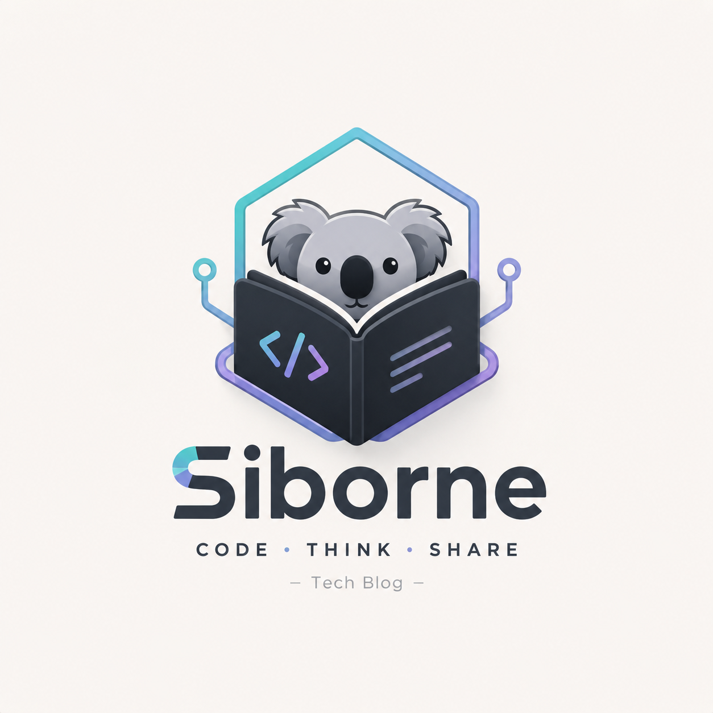

<p align="center">
  
</p>

# Software Engineering Handbook

从 Java Developer 到 AI Software Engineer 的成长路线 — 一个面向后端开发者的软件工程知识库，系统梳理从编程语言、后端框架、数据库、系统设计到 AI 工程化的完整技术图谱。

写给所有想体系化提升工程能力的同学：Java/Go 后端、全栈、架构师、以及正在向 AI Engineer 转型的开发者都可以看。这里不追求面面俱到的 API 文档，而是聚焦**技术决策背后的 Why**、**工程实践的踩坑点**和**从 Demo 到生产的真实路径**。

如果你是 Java 后端，这里的 Spring、MyBatis、Netty、RPC、并发、JVM 可以帮你查漏补缺；如果你在往 AI 方向走，AI 工程、Agent、MCP、RAG、AI Coding 这些板块会把工程落地的链路串起来。

- **项目地址**：<https://github.com/Siborne/software-engineering-handbook>
- **在线阅读**：<https://siborne.github.io/software-engineering-handbook>（待部署）

内容还在持续建设中，欢迎 Star，也欢迎提 Issue 一起完善。

## 特色栏目

| 栏目 | 说明 |
|---|---|
| **Why 系列** | 不只讲"怎么用"，更追问"为什么这样设计"背后的工程权衡 |
| **If I Were** | 如果让我重新设计 GitHub / Cursor / 微信——从架构视角推演系统演进 |
| **AI x SE** | AI 工程与软件工程的交叉实践：Prompt、Agent、MCP、RAG、评测 |
| **Project Evolution** | 项目从 Day 1 到 Day N 的真实演进过程 |

## 怎么读

如果你是第一次系统学习某个技术方向，建议按板块递进：

1. **Getting Started** — 先搞清楚这个知识库的定位、阅读方法和学习路线
2. **编程语言 & 后端** — Java 核心（集合、并发、JVM）+ Spring 全家桶 + MyBatis + Netty + RPC
3. **数据库** — MySQL、Redis、MongoDB、Elasticsearch 的工程实践
4. **软件工程** — 设计模式、DDD、架构、重构、测试、Code Review、CI/CD、可观测性
5. **系统设计** — 缓存、消息队列、一致性、限流、分布式锁、数据库设计、权限/登录系统
6. **AI 工程** — Prompt、Context Engineering、Memory、MCP、Agent、Workflow、Evaluation、RAG、Tool Calling
7. **AI Coding** — Claude Code、Codex、Cursor、Gemini CLI、Copilot 的工程实践和 Prompt 技巧
8. **论文阅读** — 经典分布式和 AI 论文的工程化解读
9. **工具 & 职业** — Git、Docker、Linux、简历、面试、职业规划

AI Coding 不是一条独立的学习线，它更像是日常研发方式的升级。建议一边学后面几个技术板块，一边用 Claude Code、Codex、Cursor 这类工具实际写代码、补测试、做重构来练手感。

## 内容板块

### Getting Started

- 为什么建立这个知识库
- 如何高效阅读技术文档
- 推荐学习路线
- 如何正确提问
- 如何利用 AI 辅助学习

### 编程语言

- Java 集合：HashMap、ArrayList、并发容器源码分析
- Java 并发：线程池、锁、AQS、CompletableFuture
- JVM：内存模型、GC 调优、类加载、性能诊断
- Java 新特性：8 → 21 关键 feature 实战

### 后端开发

- Spring / Spring Boot 核心原理与工程实践
- MyBatis 源码与最佳实践
- Netty 网络编程
- RPC 原理与实现
- Spring AI / Spring AI Alibaba — Java 栈的 AI 集成方案

### 数据库

- MySQL：索引、事务、锁、SQL 优化、分库分表
- Redis：数据结构、缓存策略、分布式锁、集群方案
- MongoDB：文档模型设计、聚合管道
- Elasticsearch：全文检索、聚合分析、运维实践

### 软件工程

- 设计模式在业务系统中的应用
- DDD 领域驱动设计落地指南
- 架构设计原则与模式
- 代码重构的系统方法论
- 测试策略：单测、集成测试、E2E
- Code Review 最佳实践
- CI/CD 流水线设计
- 可观测性：日志、指标、链路追踪

### AI 工程

- Prompt Engineering：Few-Shot、CoT、结构化输出
- Context Engineering：上下文组装、Token 预算、信息挂载
- Memory 系统：短期/长期记忆、检索与演化
- MCP 协议：Host、Client、Server、Tools、Resources
- AI Agent：Agent Loop、Plan & Execute、Tool Calling
- Agent Workflow：Workflow、Graph、Loop 编排模式
- Evaluation：Golden Set、LLM-as-Judge、线上回归
- RAG：文档处理、向量检索、召回优化、GraphRAG

### 系统设计

- 缓存系统设计
- 消息队列选型与设计
- 分布式一致性协议
- 限流算法与方案
- 分布式锁实现
- 数据库设计与分片策略
- 认证授权系统设计（RBAC、OAuth2、SSO）
- 登录系统设计
- If I Were 系列：重新设计 GitHub / Cursor / 微信

### 项目深度解析

- Delper — 项目架构与演进复盘
- Blog 系统 — 从单体到微服务
- AI Agent 项目实战

### AI Coding

- Claude Code / Codex / Cursor / Gemini CLI / Copilot 对比与实践
- AI 编程 Prompt 技巧
- Context 管理策略
- Agent Workflow 设计

### 论文阅读

- MapReduce / BigTable / Spanner — Google 分布式三部曲
- Transformer / Attention — 大模型基础论文工程化解读
- RAG / MCP — 最新技术论文拆解

### 工具

- Git / GitHub 工作流
- Docker 容器化实践
- Linux 常用命令与调优
- Nginx 反向代理与负载均衡
- Cloudflare 边缘网络
- VSCode / Cursor IDE 配置

### 职业成长

- 技术学习方法论
- 如何积累项目经验
- 简历撰写指南
- 面试准备策略
- 职业规划与成长路径

## 本地开发

```bash
# 安装依赖
pnpm install

# 启动开发服务器
pnpm docs:dev

# 构建静态站点
pnpm docs:build

# 预览构建结果
pnpm docs:preview
```

## 技术栈

VitePress + Vue 3 + pnpm，本地搜索，自定义主题。

## License

本项目内容采用 [CC BY 4.0](LICENSE) 协议发布。你可以自由分享、转载、翻译和二次创作，但需注明原作者和出处。

---

> Learn the principles. Build real systems. Think like an engineer.
> 学习原理，构建系统，像工程师一样思考。
